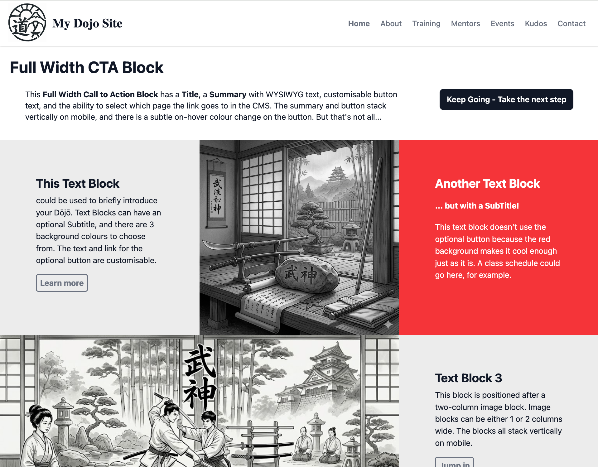
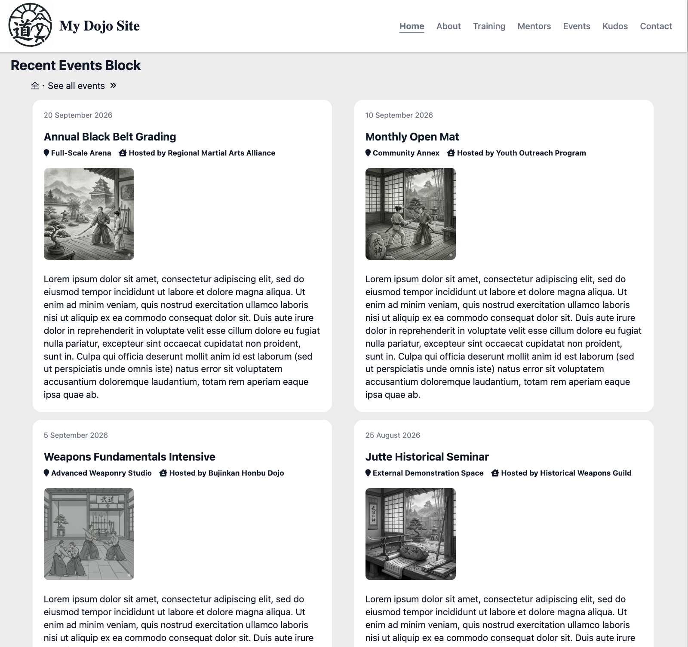
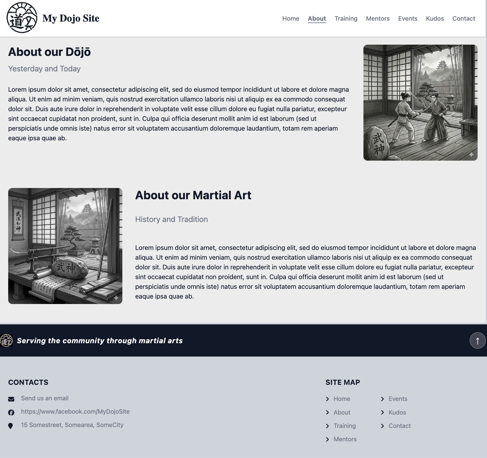
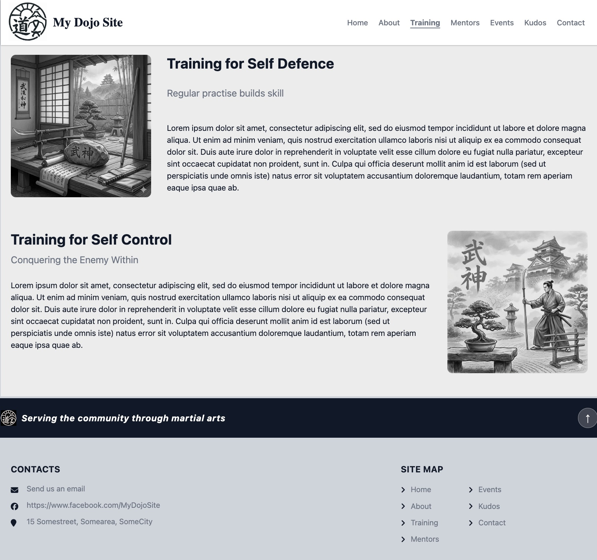
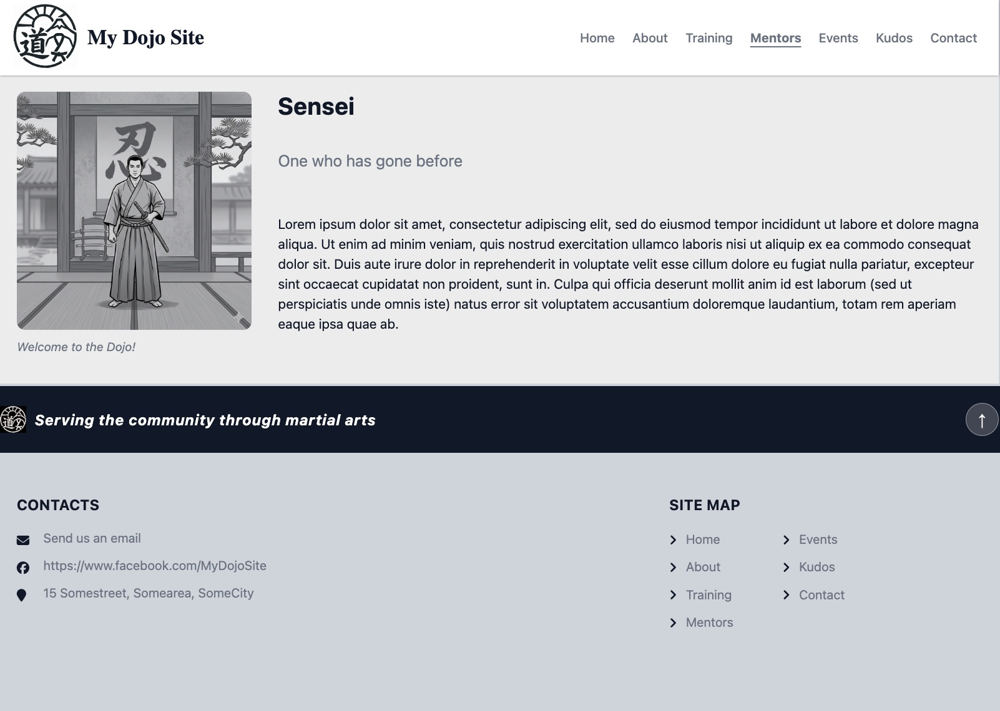
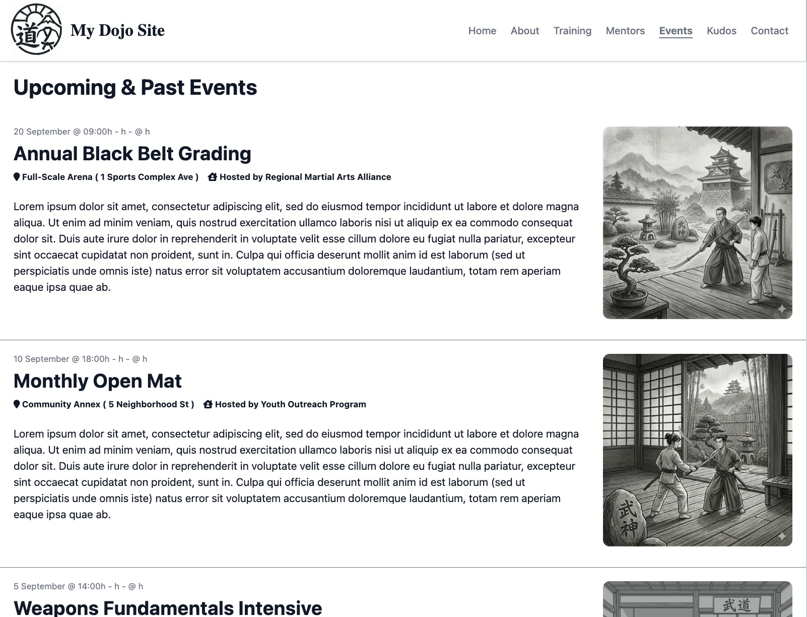
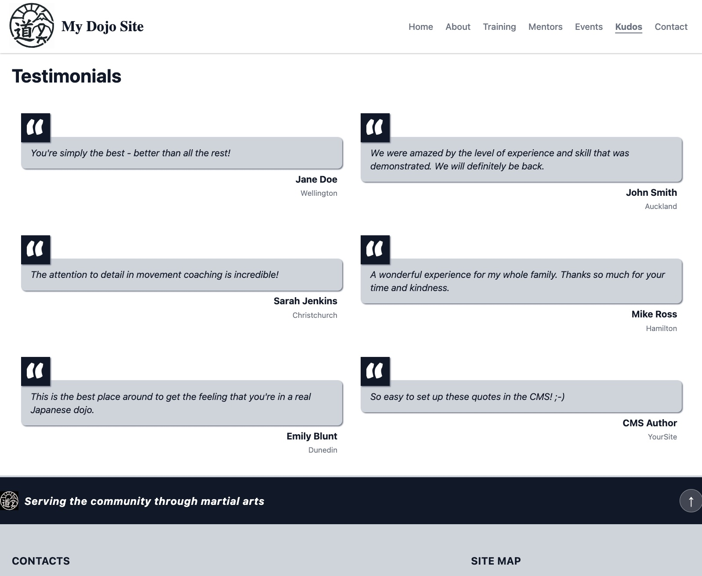
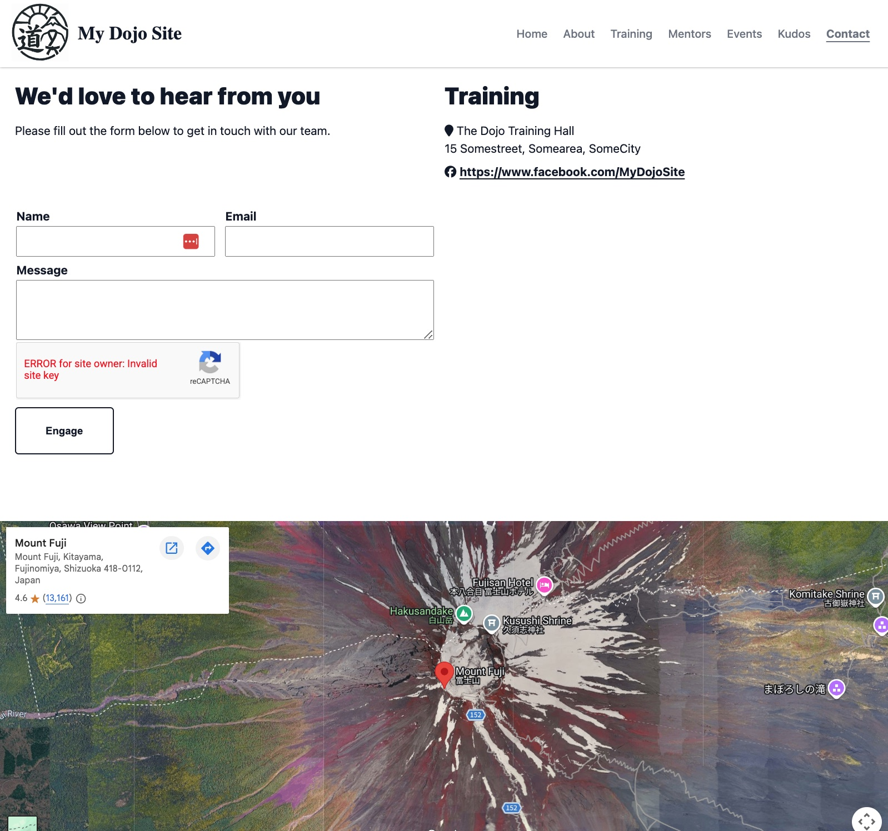

# MyDojoSite (Build your own martial arts website)

## Open-source website project built with Silverstripe CMS 6
### Featuring good stuff like:
  - Fully customizable components and content
  - Five page types
  - Six block types
  - Three data models (Quotes, Testimonials, Events)
  - Sample data with population script
  - Unit tests
  - E2E (Cypress) tests

### What's Inside
- Overview
  - [Screenshots](#screenshots)
  - [Features](#features)
  - [Target viewport widths (breakpoints)](#target-viewport-widths)
- How It Works
  - [Common components](#common-components)
  - [Page types](#page-types)
  - [Block types](#block-types)
  - [Events data model](#events-data-model)
  - [Testimonials data model](#testimonials-data-model)
  - [Quotes data model](#quotes-data-model)
- Let's Do This!
  - [Install it](./docs/installation.md)
  - [Test it](./docs/testing.md)

### Screenshots
<table>
<tr>
  <td valign="top"></td>
  <td valign="top"></td>
  <td valign="top"></td>
</tr>
<tr>
  <td valign="top"></td>
  <td valign="top"></td>
  <td valign="top"></td>
</tr>
<tr>
  <td valign="top"></td>
  <td valign="top"></td>
  <td valign="top"></td>
</tr>
</table>

[Back to Top](#mydojosite-build-your-own-martial-arts-website)

### Features
- **Page Types**
  - Home page
  - Content page
  - Event listing page
  - Contact page
  - Testimonials page
- **Elemental Blocks**
  - Full-width CTA block
  - Text block
  - Text + image block
  - Video Text block
  - Image block
  - Recent events block
- **Data Models**
  - Quotes (used in optional random quote feature in text block)
  - Testimonials (used on Testimonials / "Kudos" page)
  - Events:
    - Events
    - Hosts
    - Locations
    - Vendors
    - Services

[Back to Top](#mydojosite-build-your-own-martial-arts-website)

## Target viewport widths
- 1200px  // Desktop
- 992px   // Tablet Large
- 768px   // Tablet Small
- < 768px // Mobile

[Back to Top](#mydojosite-build-your-own-martial-arts-website)

## Common components
### Logos
The logo used in both the header and footer is the same svg file,
whose path is hard-coded in the header and footer templates.  Using svg
allows the same file to be used for both logos, however the CMS prevents
upload of svg files, which is why the path is hard-coded.

### Header
- Logo
- Nav Bar
  - Nav Item

### Footer
- Site Map (2 Col)
- Contacts
  - Email
  - URL
  - Location

[Back to Top](#mydojosite-build-your-own-martial-arts-website)

## Page types
- Home Page
 
- Content Page 
  - "About", "Training", "Mentors"

- Events Listing Page
  - Page Title h1
  - List Events descending StartDate
  - For each Event
      - Full-width card 
      - Date @ Time - Date @ Time
        - If no EndDate or if EndDate == StartDate, omit EndDate
      - Title (h2 or h3), linked to Event Page
      - Summary (truncated to x characters if needed)

- Testimonials Page

- Contact Page
  - ContactForm
  - Google Map Block

[Back to Top](#mydojosite-build-your-own-martial-arts-website)

## Block types
### CTA Block (Full Width)
> Used on: Home Page
- CTABody
  - Title
  - Summary
- CTAButton
  - ButtonText
  - ButtonURL

### Text Block
> Used on: Home Page
- BackgroundColour
- ForegroundColour
- Title
- Summary
- TextBlockButton [Optional]
  - ButtonText
  - ButtonURL

### Image Block
> Used on: Home Page
- Image

### Recent Events Block
> Used on: Home Page
- I can see the 4 most recent events on the home page
- When I click on an event image / link, I am taken to the associated Event Page
- I can see a "Show all -->" button that links to the Event Listing Page

### Image Text Block
> Used on: Content Pages ("About", "Training", "Mentors")
- Title
- SubTitle
- Background Colour (White, Light Grey, Dark Grey, Red)
- Image1 (image or video)
- Image1Caption [Optional]
- Image2 [Optional]
- Image2 Subtitle [Optional]
- Video
- MediaPlacement (L / R)
- Content

[Back to Top](#mydojosite-build-your-own-martial-arts-website)

## Events data model
Information will be added to this section in due course.

[Back to Top](#mydojosite-build-your-own-martial-arts-website)

## Testimonials data model
Information will be added to this section in due course.

[Back to Top](#mydojosite-build-your-own-martial-arts-website)

## Quotes data model
Information will be added to this section in due course.

[Back to Top](#mydojosite-build-your-own-martial-arts-website)

